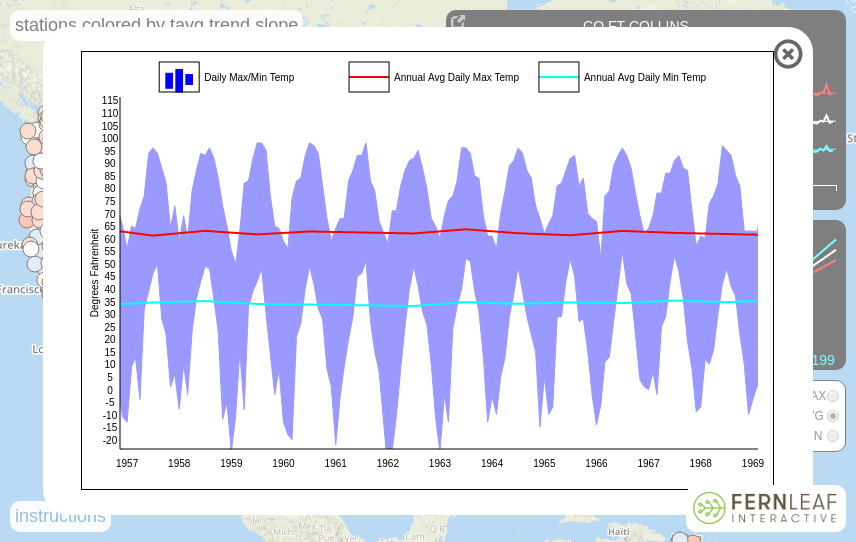

# Temperature Trend Map

## Overview

This an interctive web application that lets the user explore and visualize
long term daily temperature data from the
[Global Historical Climatology Network](https://www.ncdc.noaa.gov/data-access/land-based-station-data/land-based-datasets/global-historical-climatology-network-ghcn).

You can view it online here: http://demos.fernleafinteractive.com/temperature-trends

And here's a short video screencast demo: https://www.youtube.com/watch?v=b1NsRnbRwD0

## Usage Instructions
   
When the map first appears, it shows the 2094 stations colored according to
the average of these two slopes, with red corresponding to positive values,
and blue corresponding to negative values.

As you mouse over the stations in the map, the two black inset windows show
the annual average TMIN and TMAX plots, along with their trend lines.  The
TMAX plot is red and the TMIN plot is cyan.  The white plot is the average
of the two.

The smaller black inside window shows the trend lines, with their
slopes magnified by a factor of 10, just so that you can better see
the direction of the slope.

Clicking on a station will "lock" the program onto that station; clicking
on any station thereafter will unlock it.

You can click on the little pop-out icon in the upper left corner of the
first black inset graph (the one showing the annual plots along with the
trend lines), to cause an interactive Multigraph to appear which shows
the annual average plots along with the underlying daily data.  This plot
is configured to switch between displaying a monthly aggregate of
the daily data at large zoom levels, but switches to show the actualy daily
values when zoomed in to a period of about 10 years or less.

## Setup

## Data Analysis

I made this as a demonstration of one way to visualize climate data; it's intended simply
as a demonstration of the software involved, not as a definitive statement about trends
in climate data.

Here's what went into it:

1. I downloaded all the daily station data from the web site above.  The
   entire data set contains data from roughly 90,000 stations.
   
2. I eliminated all data except for TMIN and TMAX, the daily temperature
   minimum and maximum values.  The whole analysis here involves only
   those two parameters.
   
3. I eliminated all stations that did not have TMIN and TMAX data for at least 90% of
   all days in the period 1950-2010.  That left 2094 stations.
   
4. For each of those 2094 stations, for each year starting with 1900
   for which the station had TMIN/TMAX data, I computed the average TMIN
   and TMAX values for the year.  I did not do this, however, for any years
   in which there was a stretch of more than 7 days of missing TMIN or TMAX
   data.  This produces two time-series of annual data for each station,
   one each for TMIN and TMAX.

5. For each of the above annual average TMIN/TMAX time series, I computed
   a linear least-squares best-fit line for the series.
   
The code that performed the above analysis is written in Clojure and
is available here: 
[http://github.com/embeepea/ghcn-trend-analysis](http://github.com/embeepea/ghcn-trend-analysis).

