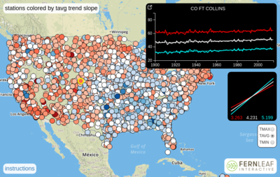
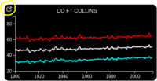

# Temperature Trend Map

## Overview

This an interctive map that lets you explore
long term daily temperature data from
[NOAA's Global Historical Climatology Network](https://www.ncdc.noaa.gov/data-access/land-based-station-data/land-based-datasets/global-historical-climatology-network-ghcn).

You can view it online here: http://demos.fernleafinteractive.com/temperature-trends

And here's a short video screencast demo: https://www.youtube.com/watch?v=b1NsRnbRwD0

I made this program as a demonstration of one way to visualize a lot
of long term time seriesdata.  It's intended simply as a demonstration
of the software involved, not as a definitive statement about trends
in climate data.

## Usage Instructions

The map shows just over 2000 weather stations in the United States, colored
according to how the annual average temperature changed at that station over the 20th century.
A red color indicates an increase, and a blue color indicates a decrease, with the
intensity of the color indicating the amount of change.

As you move the mouse over the stations in the map, the large black
inset graph in the upper right corner shows the annual data from each
station. Clicking on a station will "lock" the display onto that station; clicking
on any station thereafter will unlock it.

In the large black inset graph, the red plot shows the annual average
of the daily maximum temperature for the selected station, and the cyan plot shows the annual
average of the daily minimum temperature.  The white plot is the
average of these two.  Each of these three plots show the actual annual
timeseries, as well as the trend line associate with it.

The smaller black inside window shows the trend lines, with their
slopes magnified by a factor of 10, just so that you can better see
the direction of the slope.

You can click on the little pop-out icon in the upper left corner of the
large black inset graph to get a detailed graph of the individual daily values
for that station.

The graph is interactive -- you can pan the graph with the mouse, and/or
use the mouse scroll wheel to zoom in or out.  You can also zoom by holding
down the keyboard shift key while dragging with the mouse.  Click the X in
the upper right corner of the graph to return to the map.

See the **Data Analysis** section below for more details on the data.

## Why Are There So Many Blue Stations?

If you're wondering why there are so many stations in the southeast where the
trend seems to be towards cooling rather than warming, you're not alone.
This is an example of a well-known phenomenon in the climate science world
known as a "warming hole".  If you look at how temperature has been changing
across the entire surface of the earth, overwhelmingly most locations show
a warming trend.  But the change isn't uniform, and there are some places
such as the southeast US, where the trend is in the other direction.
You can read more about this phenomenon in this
[excellent article on climate.gov](https://www.climate.gov/news-features/climate-qa/does-global-warming-mean-it%E2%80%99s-warming-everywhere).

## Setup

If you want to run your own copy of this program, there is just one
setup step required after cloning the repo.  The map uses tiles from
[Mapbox](www.mapbox.com), and you will need to get your own Mapbox
access token.  This is easy to do and you can use the free starter
plan for limited use; just visit the [Mapbox web site](www.mapbox.com)
and follow the instructions.  Then make a copy of the file
`map-config.tpl.js` named `map-config.js`, and edit that copy of the
file to insert your Mapbox token.

Once you have `map-config.js` set up, just point your browser to your copy
of `index.html`.  There is no build step required, and the project
includes a copy of all of its dependencies.

## Data Analysis

Here are the details of how I processed the data for this program:

1. I downloaded the file `ghcnd_all.tar.gz` from the
   [GHCN Daily ftp site](ftp.ncdc.noaa.gov/pub/data/ghcn/daily).
   The entire data set contains data from roughly 90,000 stations.
   
1. I eliminated all stations that are not in the United States.  It would
   be very interesting to do this analysis with the entire data set,
   but in this project I wanted to focus just on US data.

1. I eliminated all data except for TMIN and TMAX, the daily temperature
   minimum and maximum values.  The whole analysis here involves only
   those two parameters.
   
1. I eliminated all stations that did not have TMIN and TMAX data for at least 90% of
   all days in the period 1950-2010.  That left 2094 stations.
   There's nothing magical about the period 1950-2010 --- I just wanted some way
   to filter out stations that did not have both relatively recent data, and
   data for a significant fraction of the 20th century.
   
1. For each of those 2094 stations, for each year starting with 1900
   for which the station had TMIN/TMAX data, I computed the average TMIN
   and TMAX values for the year.  I did not do this, however, for any years
   in which there was a stretch of more than 7 days of missing TMIN or TMAX
   data.  This produces two time-series of annual data for each station,
   one each for TMIN and TMAX.

1. For each of the above annual average TMIN/TMAX time series, I computed
   a linear least-squares best-fit line for the series.
   
The code that performed the above analysis is written in Clojure and
is available here: 
[http://github.com/embeepea/us-temperature-trend-analysis](http://github.com/embeepea/us-temperature-trend-analysis).
